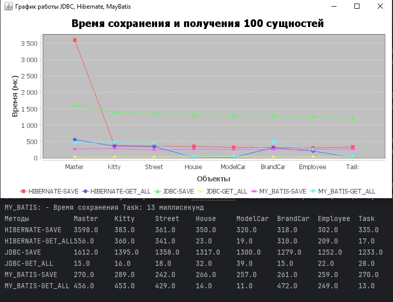

# Hi, I'm Dentapinos! 👋

Используемые фреймворки в данной работе

| Rank | Frameworks |
|-----:|------------|
|     1| JDBC       |
|     2| Hibernate  |
|     3| MyBatis    |

# Домашнее задание №9 - Создание базы данных Mysql, выполнение CRUD с помощью HIBERNATE, JDBC, MyBatis

Сокращенно. Создать таблицы в базе данных MySql. Реализовать указанные методы работы с базой данных: 
public T save(T entity); 
public void deleteById(long id); 
public void deleteByEntity(T entity); 
public void deleteAll(); 
public T update(T entity); 
public T getById(long id); 
public List<T> getAll(); 
для каждого из фреймворков: JDBC, Hibernate, MyBatis. 
Отправить в бд запрос на добавление 100 сущностей и сравнить время, за которое это будет выполнено
всеми тремя способами.
Затем отправить запрос на получение этих же самых 100 сущностей,
(можно использовать метод getAll()), и также сравнить время, за которое это будет сделано тремя различными способами.
[Подробное описание дз](https://github.com/Kichmarevitmo/Lesson-11.-Part-1.-Homework)

## Что я сделал
Для каждого из фреймворков и на каждую отдельную сущность я создал репозиторий.
Далее я создал репозиторий для основной логики. В каждом репозитории и сервисе я произвел логирование с помощью SLF4J.
Что бы протестировать корректность выполнения запросов к БД я написал тесты, и для быстрого выполнения этих тестов я
подключил базу данных H2.
Что бы выполнить замер времени я создал класс TimeMeasurement в котором по методу run(),
будет произведен запуск выполнения сохранения и получения 100 записей(количество можно указать в конструкторе).
Так же для наглядности полученных данных я создал класс вывода в отдельном экране данных в виде графика.

## Настройка конфигураций
### Основные настройки
[JDBCManager.java](src/main/java/org/example/configs/JDBCManager.java) в файле JDBCManager.java
нужно указать:

    String bdTableName = "test";
    String bdLogin = "root";
    String bdPassword = "password";

bdTableName - имя схемы в MySql базе. 
bdLogin - логин от базы MySql 
bdPassword - пароль от базы MySql 

[hibernate.cfg.xml](src/main/resources/hibernate.cfg.xml) настройка hibernate

    <property name="hibernate.connection.url">jdbc:mysql://localhost:3306/test</property>
    <property name="hibernate.connection.username">root</property>
    <property name="hibernate.connection.password">password</property>

Те же данные что и выше. 
для отображения sql запросов можно раскоментировать следующие строки

    <property name="hibernate.show_sql">true</property>
    <property name="hibernate.format_sql">true</property>

Для определения стратегии создания таблиц с помощью Hibernate можно изменять значение в следующей строке

      <property name="hibernate.hbm2ddl.auto">update</property>

на update, create-drop, create.

[mybatis-config.xml](src/main/resources/mybatis-config.xml) настройка myBatis

        <property name="driver" value="com.mysql.cj.jdbc.Driver"/>
        <property name="url" value="jdbc:mysql://localhost:3306/test"/>
        <property name="username" value="root"/>
        <property name="password" value="password"/>

### Настройка тестов

При тестировании я использовал базу h2, и отдельно для тестов создал файлы настроек
которые так же по желанию можно изменить:

[JDBCManager.java](src/test/java/configs/JDBCManager.java) настройка JDBC
[hibernate.cfg.xml](src/test/resources/hibernate.cfg.xml) настройка hibernate
[mybatis-config.xml](src/test/resources/mybatis-config.xml) настройка myBatis

## Описание
org/example/configs Тут собраны менеджеры настроек подключения к базе данных 
[HibernateManager.java](src/main/java/org/example/configs/HibernateManager.java) - настройки подключения к бд для Hibernate 
[JDBCManager.java](src/main/java/org/example/configs/JDBCManager.java) - настройки подключения к бд для Hibernate 
[MyBatisConfig.java](src/main/java/org/example/configs/MyBatisConfig.java) - настройки подключения к бд для Hibernate 
[SessionManager.java](src/main/java/org/example/configs/SessionManager.java) - фабрика подключений 

org/example/entity Тут собраны сущности 
[BrandCar.java](src/main/java/org/example/entity/BrandCar.java) - сущность бренда машины, может иметь множество моделей 
[ModelCar.java](src/main/java/org/example/entity/ModelCar.java) - сущность модели машины, может иметь только один бренд, и не может существовать без бренда 
[Master.java](src/main/java/org/example/entity/Master.java) - сущность хозяина кошек, может иметь множество кошек 
[Kitty.java](src/main/java/org/example/entity/Kitty.java) - сущность кошки, может иметь множество хозяев 
[Street.java](src/main/java/org/example/entity/Street.java) - сущность улицы, может иметь множество домов 
[House.java](src/main/java/org/example/entity/House.java) - сущность дома, может иметь только одну улицу и не может существовать без улицы 
[Employee.java](src/main/java/org/example/entity/Employee.java) - сущность сотрудника, может выполнять только одну задачу 
[Task.java](src/main/java/org/example/entity/Task.java) - сущность задачи, может быть взята только одним сотрудником 

org/example/exception классы собственных исключений во время работы приложения 

org/example/mappers Интерфейсы работы с мапперами для MyBatis, выступает в качестве репозитория 

org/example/repositories Содержит в себе пакеты с репозиториями для каждого из фреймворков 

org/example/service В этом пакете описаны сервисы. Вся логика работы с базой и логирование находится тут  

org/example/utils Утилиты для работы 
[CreatorTablesUtil.java](src/main/java/org/example/utils/CreateDropTablesUtil.java) - класс для выполнения операций создания, удаления таблиц, обновление авто-инкремента 
[EntityCreatorUtil.java](src/main/java/org/example/utils/EntityCreatorUtil.java) - удобная утилита для быстрого создания большого количества сущностей 
[Graph.java](src/main/java/org/example/utils/Graph.java) - класс который принимает DataSet и строит график из полученных данных 

org/example Основные классы для работы 
[TimeMeasurement.java](src/main/java/org/example/TimeMeasurement.java) - класс для выполнения тестов сохранения и чтения 100(любое число) записей всех сущностей,
а также сбор данных в DataSet

hibernate.cfg.xml файл настройки hibernate, для [HibernateManager.java](src/main/java/org/example/configs/HibernateManager.java) 
mybatis-config.xml файл настройки myBatis, для [MyBatisConfig.java](src/main/java/org/example/configs/MyBatisConfig.java) 
logback.xml файл настройки для логирования  

## Тесты
Для тестирования запросов в базу данных я использовал H2 базу данных. Также для тестов я 
создал дополнительный файлы hibernate.cfg.xml и
mybatis-config.xml а так же конфигурационные классы
src/test/java/org/example/configs. 
[src/test/java/example/service](src/test/java/example/service) - пакет тестов для всех сущностей используя разные технологии 

## Что узнал и чему научился
Углубился в понимание JDBC, познакомился и вник в работу Hibernate и MyBatis. 
JDBC это низкоуровневый язык использующий для выполнения запросов в базу язык SQL. 
Hibernate — это ORM (Object-Relational Mapping) фреймворк, который позволяет работать с базами данных через объекты Java.
Он позволяет автоматически создавать SQL запросы посредством аннотаций, что я и сделал.
Под капотом Hibernate имеет тот же самый JDBC. Для работы с объектами Hibernate имеет два уровня кеша,
Первый уровень хранит загружаемые и сохраняемые объекты для работы с ними в не базы данных, 
это уменьшает количество обращений в базу, а второй уровень хранит данные сессий.
Так же он имеет кеш запросов и кеш коллекций, что уменьшает количество запросов в базу.
Для особых запросов Hibernate использует свой язык запросов HQL или JPQL. 
MyBatis позволяет писать произвольные запросы и мапить результаты на объекты. Язык Sql.
Для мапинга использует xml файлы или аннотации, я использовал xml.

## Результаты выполнения ДЗ

| Framework/method   | Master | Kitty  | Street | House  | ModelCar | BrandCar | Employee | Task   |
|--------------------|--------|--------|--------|--------|----------|----------|----------|--------|
| HIBERNATE-SAVE     | 3598.0 | 383.0  | 361.0  | 350.0  | 320.0    | 318.0    | 302.0    | 335.0  |
| HIBERNATE-GET_ALL  | 556.0  | 360.0  | 341.0  | 23.0   | 19.0     | 310.0    | 209.0    | 17.0   |
| JDBC-SAVE          | 1612.0 | 1395.0 | 1358.0 | 1317.0 | 1300.0   | 1279.0   | 1252.0   | 1233.0 |
| JDBC-GET_ALL       | 15.0   | 16.0   | 18.0   | 32.0   | 39.0     | 15.0     | 22.0     | 28.0   |
| MY_BATIS-SAVE      | 270.0  | 289.0  | 242.0  | 266.0  | 257.0    | 261.0    | 259.0    | 270.0  |
| MY_BATIS-GET_ALL   | 456.0  | 453.0  | 429.0  | 14.0   | 11.0     | 472.0    | 249.0    | 13.0   |

Выводы Сохранение 
По скорости сохранения я вижу, судя по данным, что Hibernate чуть дольше сохраняет чем MyBatis.
А JDBС существенно отстает по скорости сохранения.

Выводы Получение 
Получение с помощью JDBC происходит максимально быстро. 
А Hibernate и MyBatis производят получение с той же скоростью, что и сохранение.
От JDBC они отстают за счет кеширования данных.
Так же на графике видно что House и ModelCar они получают быстрее, 
это связано с тем что House и Street имеют только по одной вложенной сущности, а не коллекцию.

## Authors

- [@Dentapinos](https://github.com/Dentapinos)

